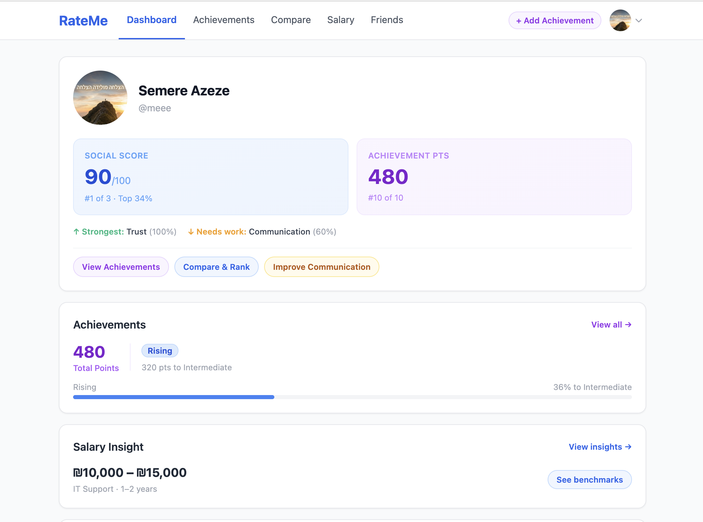
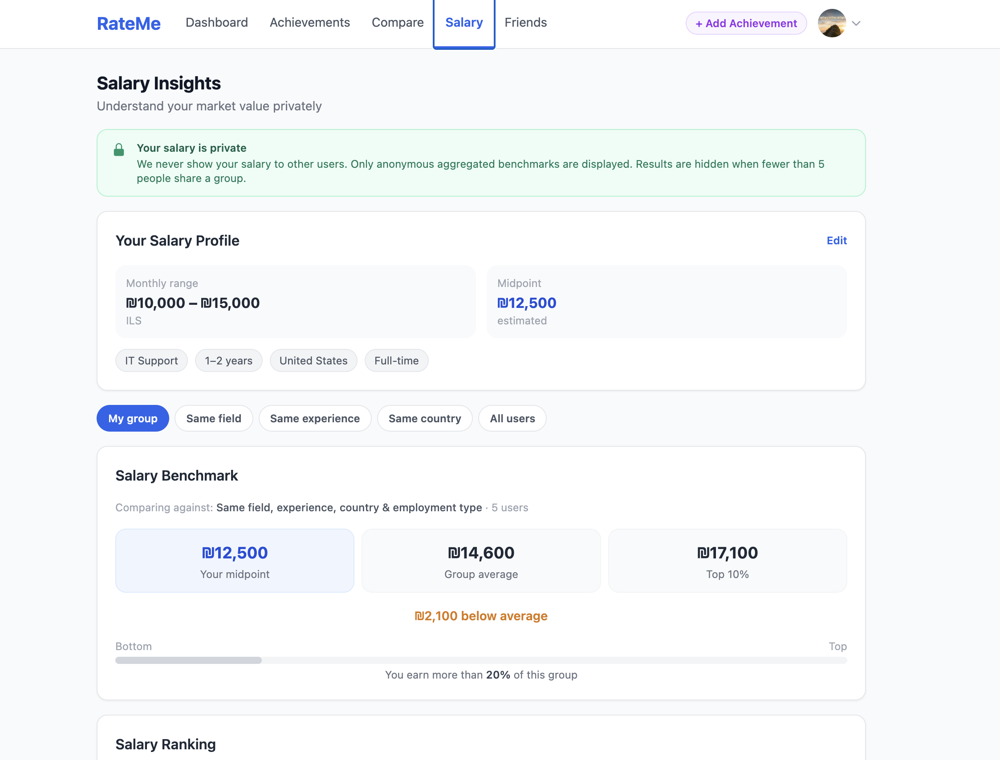
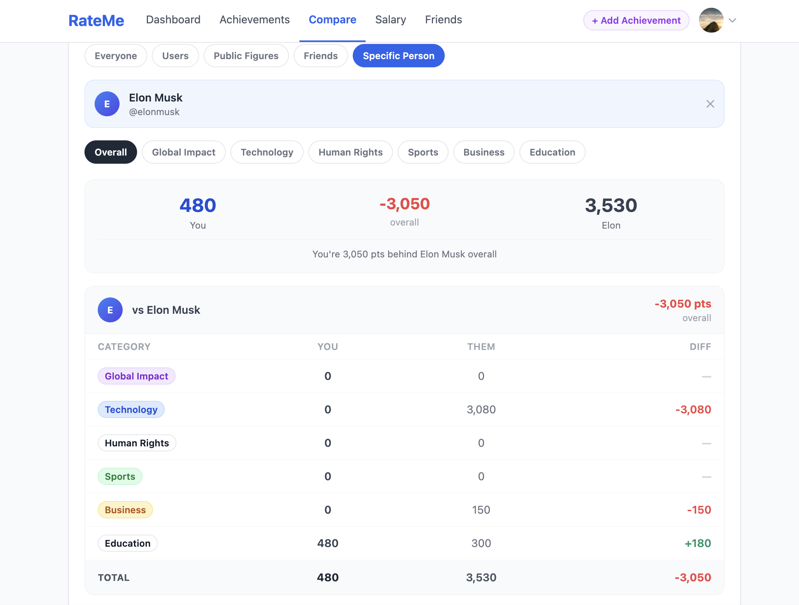
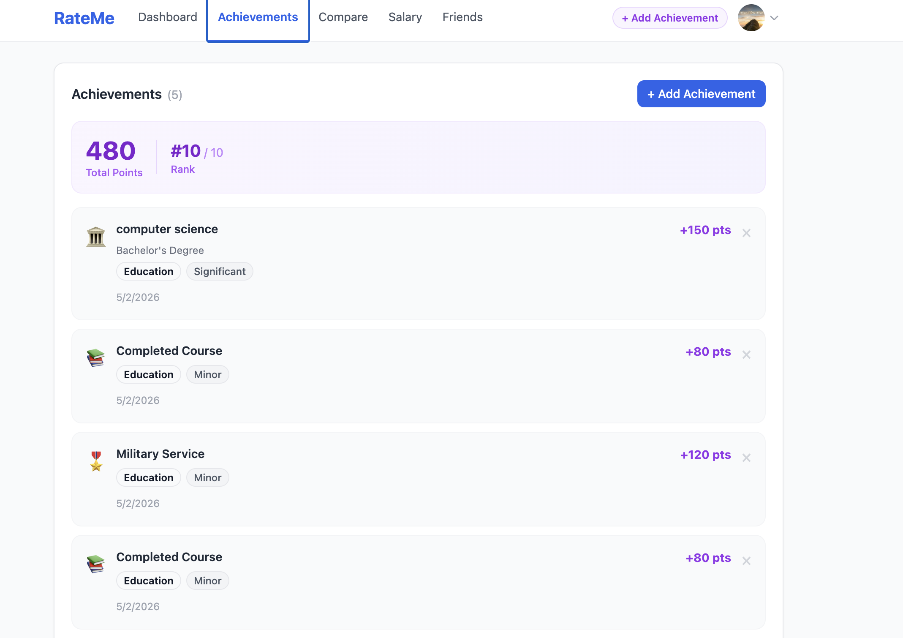

# RateMe

**Full-stack social ranking, achievements, comparison, and salary benchmarking platform.**

Users build a profile across three dimensions — social reputation, personal achievements, and salary — then compare themselves against friends, other users, and public figures.

---

## Screenshots






---

## Features

### Social Rating System

- Rate friends across Trust, Communication, Helpfulness, and Respect
- Only accepted friends can rate each other
- No anonymous ratings — rater identity is always stored

### Achievement System

- Add achievements: education, work experience, business, military, volunteering, and more
- Each achievement is weighted by category and impact level
- Global ranking based on accumulated points

### Compare & Ranking Engine

- Compare your score against friends, other users, and public figures (e.g. Elon Musk)
- Category breakdown: Technology, Business, Education, Global Impact
- Shows exact score difference per category

### Salary Benchmark System

- Enter a salary range (monthly, with currency)
- Benchmarks filtered by field, experience level, and country
- Shows average, top 10%, and percentile distribution
- Results hidden when fewer than 5 users match — no individual data is ever exposed

### Privacy-First Salary Design

- Salaries are private by default (`is_private = true`)
- Separate opt-in: "Use my salary anonymously in benchmarks" (`include_in_benchmarks`)
- Benchmark calculations run inside Supabase via `SECURITY DEFINER` functions — raw rows never leave the database
- RLS policies ensure users can only read or write their own salary record

### Achievement Salary Insight

- Shows average salary of users with a similar achievement score (±50% range)
- Requires at least 5 matching users before displaying any result

### Public Figures

- Pre-seeded profiles with weighted achievement data
- Used as comparison targets on the Compare page

---

## Tech Stack

| Layer    | Technology                              |
| -------- | --------------------------------------- |
| Frontend | Next.js 14 (App Router), React, TypeScript |
| Backend  | Next.js API Routes                      |
| Database | Supabase (PostgreSQL)                   |
| Auth     | Supabase Auth (cookie-based sessions)   |
| Security | Row Level Security (RLS)                |
| Styling  | Tailwind CSS                            |

---

## Setup

### 1. Create a Supabase Project

1. Go to [supabase.com](https://supabase.com) and create a new project
2. Wait ~1 minute for initialization

### 2. Run Database Schema

Open the **SQL Editor** in your Supabase dashboard and run these files **in order**:

| Order | File | Purpose |
|-------|------|---------|
| 1 | `supabase/schema.sql` | Core tables: profiles, ratings, friendships |
| 2 | `supabase/achievements_schema.sql` | Achievement types and scoring |
| 3 | `supabase/weighted_scoring_schema.sql` | Category weights and ranking logic |
| 4 | `supabase/salary_schema.sql` | Salary profiles, RLS, benchmark RPC functions |
| 5 | `supabase/public_figures_schema.sql` | Public figure profile support |
| 6 | `supabase/seed_public_figures.sql` | Seed data for public figures |
| 7 | `supabase/fix_public_figure_categories.sql` | *(optional)* Corrects achievement category assignments |

### 3. Get API Keys

In your Supabase project: **Settings → API**

Copy:
- **Project URL** — `https://your-project-id.supabase.co`
- **anon / public** key

### 4. Configure Environment

```bash
cp .env.example .env.local
```

Edit `.env.local`:

```
NEXT_PUBLIC_SUPABASE_URL=https://your-project-id.supabase.co
NEXT_PUBLIC_SUPABASE_ANON_KEY=your-anon-key-here
```

### 5. Run

```bash
npm install
npm run dev
```

Open [http://localhost:3000](http://localhost:3000)

---

## Routes

| Page            | Route               |
| --------------- | ------------------- |
| Sign up         | `/signup`           |
| Login           | `/login`            |
| Dashboard       | `/dashboard`        |
| Profile         | `/profile/[id]`     |
| Edit profile    | `/profile/edit`     |
| Friends         | `/friends`          |
| Achievements    | `/achievements`     |
| Compare & Rank  | `/compare`          |
| Salary Insights | `/salary`           |

---

## Folder Structure

```
rateme/
├── app/
│   ├── (auth)/      → login & signup pages
│   ├── (app)/       → protected app pages
│   └── api/         → server-side API routes
├── components/      → shared UI components
├── lib/
│   ├── supabase/    → Supabase client (server + browser)
│   ├── salary.ts    → salary field/currency/country constants
│   └── achievements.ts
├── types/           → shared TypeScript types
├── supabase/        → SQL schema and seed files
├── screenshots/     → portfolio screenshots
└── middleware.ts    → route protection (redirects unauthenticated users)
```

---

## Security

- **Row Level Security** on every table — users can only access their own data
- **Salary is private by default** — `is_private = true` on all new records
- **Anonymous benchmarking** — opt-in via `include_in_benchmarks`; salary never exposed to other users
- **Minimum group threshold** — benchmarks require at least 5 users; results are hidden otherwise
- **SECURITY DEFINER functions** — aggregate queries run with elevated privileges inside Postgres; no raw salary rows are returned through the API
- **Server-side validation** on all POST routes — all inputs validated before reaching the database
- **No secrets in source** — `.env.local` is gitignored; only `NEXT_PUBLIC_*` keys are used client-side
